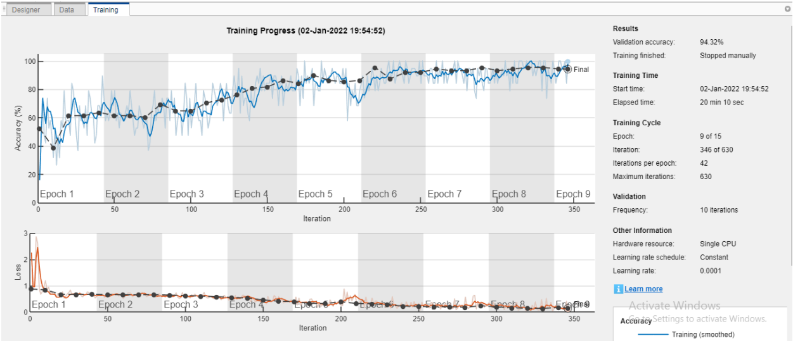

# Deep-Gender-Detector-for-Audio
classifying audio based on the speaker's gender using Resnet50

## Preprocess
By runnig PreProcess.m, some changes will be applied to the audio files (such as resizing) and finally they will be converted to **Mel Spectogram**s and saved as images.

## Train
We have done the train procedure using MATLAB's [Deep Network Designer APP](https://www.mathworks.com/help/deeplearning/gs/get-started-with-deep-network-designer.html)'s graphical interface.
Due to our dataset's comparativly small size, we decided to use Transfer Learning: we loaded a pre-trained Resnet50 network and trained it again with our dataset.
Finally we saved our trained model as **trainedNetwork_1.mat** file.
Some data about the model and trainig process is provided in the trainInfoStruct_1.mat file.

## Test
You can simply load the **trainedNetwork_1.mat** file and test it. A sample script is provided in **test.m**.

  
### More details are provided in [this document](https://github.com/MJSahebnasi/Deep-Gender-Detector-for-Audio/raw/main/Report.pdf). (written in Persian) ###
